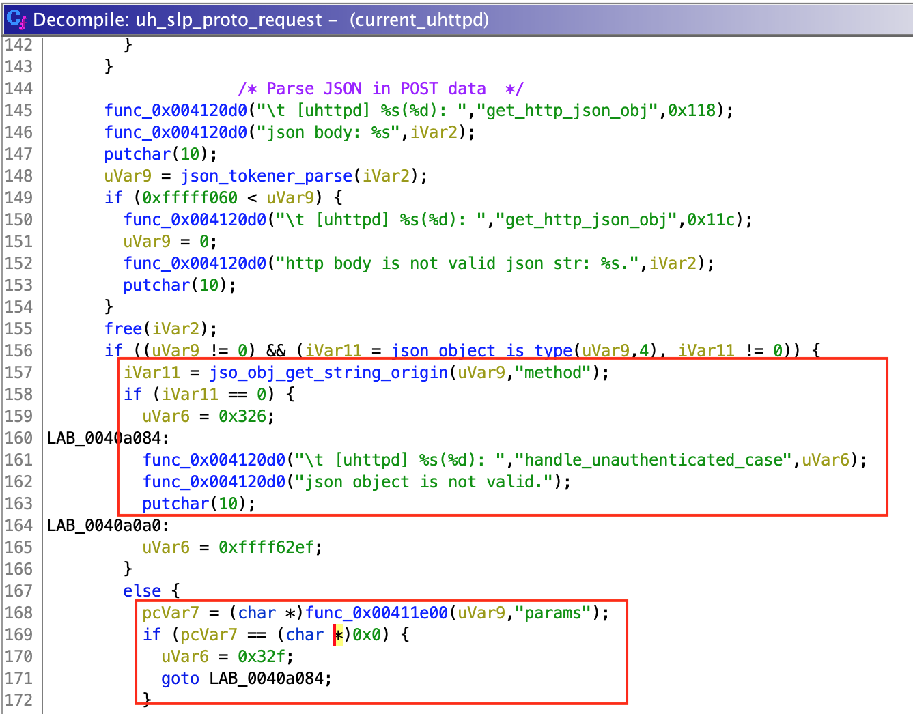
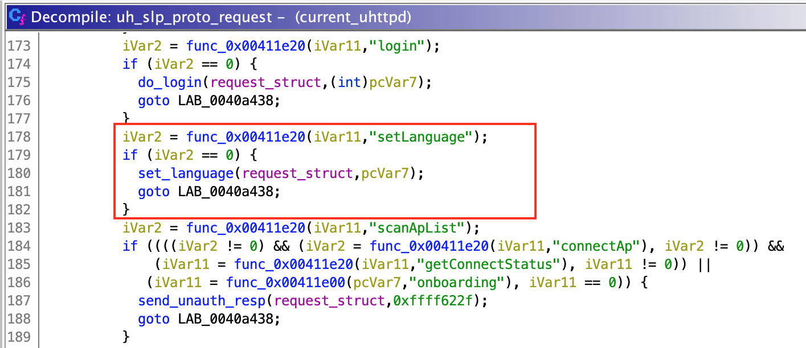

# CVE-2021-4045

CVE-2021-4045 is a Command Injection vulnerability that allows Remote Code Execution in the TP-Link Tapo c200 IP camera. It affects all firmware versions prior to 1.1.16 Build 211209 Rel. 37726N due to insufficient checks on user input in `uhttpd`, which is one of the main binaries of the device. Full write up can be found [here](https://hacefresko.github.io/posts/tp-link-tapo-c200-unauthenticated-rce).

## Exploit ([pwnTapo.py](pwntapo.py))

This is an extended version of the PoC made to show the vulnerability at the [CryptoParty Madrid 2022](https://cryptoparty.ucm.es/). It has 2 modes:

*   **shell**: Spawns a root shell on the target

    

*   **rtsp**: Gives access to the live video stream over RTSP

    

## Binary analysis

Function `exec_and_read_json` uses `popen` to execute commands:
 

`exec_and_read_json` is used by 2 unnamed functions, which I named `set_language` and `wifi_connect`. They respectively deal with language and wifi configuration (obviously). `wifi_connect` seems to parse single quotes (`'`), however, `set_language` doesn't. This means that if we can control the input for `set_language` function, we can successfully inject our own commands.

Function `set_language` is used by `uh_slp_proto_request`, the function I mentioned before, which passes as input some parsed data received from the user.

To parse the user data, `uh_slp_proto_request` checks if it is a valid JSON object. Then, it gets a string value identified by key `"method"` and a dictionary value identified by `"params"` (at least that is what I think, since function call could not be resolved by Ghidra but seemed to work this way). Depending on the selected method, `uh_slp_proto_request` selects the function which will be called.

So, by sending `{"method": "setLanguage", "params":{}}` we successfully call `set_language` function and pass `{}` as `language_json` parameter. Then, inside `set_language`, `language_json` object is converted to string and inserted directly into `"ubus call system_state_audio set_language \'%s\'"` to be executed. 

By submitting `{"method": "setLanguage", "params": {"payload": "'; touch poc;'"}}`, `ubus call system_state_audio set_language '{"payload": "'; touch poc;'"}'` will be executed, which actually contains 3 commands: `ubus call system_state_audio set_language '{"payload": "'`, `touch poc`, and `'"}'`. The second one gives us full code execution.

Now, `uh_slp_proto_request` is used by another unnamed function managing all requests, which I named `main_server_function`. If a request is valid (does not exceed maximum length, uses http or https depending on the server config, etc.), `main_server_function` checks if URL contains `/cgi-bin/luci` or `/web-static`. If it doesn't, `uh_slp_proto_request` is called.

By guessing and sending a couple of requests to the camera, we can check that data used by `uh_slp_proto_request` is regular POST data. So, if we send a POST request to `/` with the previous payload, `uh_slp_proto_request` will process this data, call `set_language` and our payload will be injected in the command executed by `exec_and_get_result`. 

As you can see, I didn't mention anything about authentication, since `setLanguage` method can be called without login. This allows any user to take full control of the camera with just one unanthenticated request.
